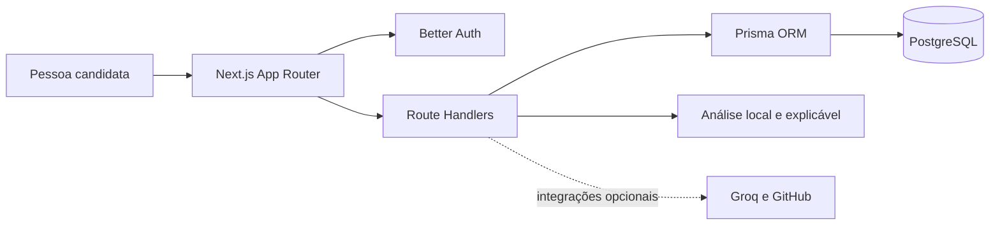

# DevReady

Plataforma de preparação para processos seletivos de tecnologia, desenvolvida para o **Hackathon Comunidade Juninhos & Nortjobs**.

O DevReady ajuda pessoas em início de carreira a entender o que uma vaga exige, reunir evidências das próprias competências e praticar entrevistas com feedback objetivo. A versão pública utiliza autenticação real e banco PostgreSQL; o modo demonstrativo permanece disponível apenas para ambientes isolados.

## Aplicação em produção

- **Site:** [devready.vercel.app](https://devready.vercel.app)
- **Saúde da aplicação:** [devready.vercel.app/api/health](https://devready.vercel.app/api/health)
- **Repositório oficial:** [github.com/juninhos-comunidade/devready](https://github.com/juninhos-comunidade/devready)
- **Ambiente:** Vercel, Node.js 22 e PostgreSQL gerenciado

## O problema

Profissionais juniores costumam encontrar descrições de vaga extensas, requisitos pouco claros e dificuldade para transformar um resultado de avaliação em um próximo passo prático. O DevReady organiza a preparação como uma jornada única por vaga:

1. interpretar os requisitos;
2. produzir um diagnóstico explicável;
3. praticar competências técnicas e comportamentais;
4. simular a entrevista;
5. transformar o desempenho em um plano de evolução.

## Principais funcionalidades

- autenticação e cadastro persistentes, inclusive sem currículo;
- dashboard com prontidão geral, evolução e notas por tecnologia;
- perfil técnico com área de interesse e nível de experiência;
- criação de sessão a partir de uma descrição de vaga ou imagem;
- diagnóstico por vaga com compatibilidade e modalidades de treino;
- matriz de evidências com status, confiança, origem e próxima ação por competência;
- treino específico por vaga com quiz técnico, resposta STAR e desafio prático;
- agente de entrevista técnica, comportamental ou mista;
- identidade visual com mascote contextual em carregamentos, orientação e estados de sucesso;
- trilha de estudo com materiais reais recomendados para cada lacuna;
- banco com **35 perguntas por área técnica**;
- seleção manual da área ou detecção pela descrição da vaga;
- perguntas adaptadas às lacunas encontradas nas respostas;
- feedback explicável por conteúdo, clareza, evidências e estrutura;
- identificação das competências mais fortes e prioritárias;
- ciclo de preparação de 7 dias com progresso salvo no dispositivo.
- histórico por vaga e recomendação de uma única próxima melhor ação.

## Arquitetura



A interface combina Server Components e componentes clientes. As rotas de API concentram autenticação, autorização e validação; o Prisma isola a persistência; e as análises locais mantêm os fluxos essenciais disponíveis quando integrações opcionais não estão configuradas. Currículo e GitHub podem ser adicionados posteriormente em **Perfil**.

## Jornada orientada por evidências

Vaga, diagnóstico, prática, entrevista e plano compartilham o mesmo contexto. O usuário não precisa colar novamente a descrição ao abrir o agente e pode retomar uma preparação pelo dashboard.

O diagnóstico diferencia três situações: **demonstrado**, **em desenvolvimento** e **não evidenciado**. “Não evidenciado” não significa falta de conhecimento; significa apenas que o sistema ainda não recebeu uma resposta, tentativa ou informação de perfil capaz de sustentar aquela conclusão.

No modo demonstrativo, qualquer evidência de currículo ou GitHub é identificada como fictícia. Sem perfil processado, o sistema não inventa pontuações do candidato.

## Diferencial: preparação que continua após a entrevista

O agente não encerra a experiência exibindo apenas uma nota. Depois da última resposta, ele apresenta:

- competência mais evidente;
- prioridade de desenvolvimento;
- justificativa de cada pergunta;
- evidências encontradas e pontos ainda não demonstrados;
- plano de preparação dividido em quatro etapas ao longo de 7 dias;
- acompanhamento de progresso de 0% a 100%;
- nova sessão focada na competência com menor desempenho.

O progresso do ciclo permanece disponível após a atualização da página. Preparações ativas e preferências de interface utilizam armazenamento do navegador; conta, perfil, currículo e resultados de treino utilizam persistência no PostgreSQL.

## Áreas disponíveis no agente

- Frontend
- Backend
- Full Stack
- Mobile
- Dados e BI
- Ciência de Dados e IA
- QA e Testes
- DevOps e Cloud
- Segurança da Informação
- Produto e UX/UI

## Demonstração

O modo demonstrativo fica desativado por padrão. Use `NEXT_PUBLIC_DEMO_MODE=true` apenas em um ambiente isolado destinado à apresentação com informações fictícias.

```text
E-mail: demo@devready.app
Senha: DevReady@2026!
```

Essas credenciais pertencem exclusivamente ao modo demonstrativo e não concedem acesso a informações reais.

## Tecnologias

- Next.js 16 com App Router
- React 19
- TypeScript
- Tailwind CSS 4
- PostgreSQL
- Prisma ORM 7
- Better Auth
- Lucide React
- Groq opcional, com extração local quando a credencial não está configurada

## Como executar localmente

### Pré-requisitos

- Node.js 22
- npm
- PostgreSQL, caso o modo autenticado seja utilizado

### Instalação

1. Clone o repositório:

   ```bash
   git clone https://github.com/juninhos-comunidade/devready.git
   cd devready
   ```

2. Instale as dependências:

   ```bash
   npm install
   ```

3. Copie o arquivo de exemplo das variáveis de ambiente:

   ```bash
   cp .env.example .env
   ```

   No Windows PowerShell:

   ```powershell
   Copy-Item .env.example .env
   ```

4. Gere o Prisma Client:

   ```bash
   npx prisma generate
   ```

5. Inicie o ambiente de desenvolvimento:

   ```bash
   npm run dev
   ```

6. Acesse [http://localhost:3000](http://localhost:3000).

## Variáveis de ambiente

| Variável | Finalidade |
| --- | --- |
| `NEXT_PUBLIC_DEMO_MODE` | Ativa os fluxos fictícios usados na apresentação |
| `DATABASE_URL` | Conexão PostgreSQL utilizada pelo Prisma |
| `BETTER_AUTH_URL` | URL pública da aplicação |
| `BETTER_AUTH_SECRET` | Segredo da autenticação; deve ser longo e privado |
| `GROQ_API_KEY` | Geração e avaliação por IA; o treino usa contingência local quando ausente |
| `GROQ_MODEL` | Modelo de texto utilizado pela integração Groq |
| `GROQ_VISION_MODEL` | Modelo usado para interpretar imagens de vagas |
| `GITHUB_TOKEN` | Consulta do perfil público do GitHub no modo autenticado |
| `NEXT_PUBLIC_SESSION_LIMIT` | Limite demonstrativo de sessões simultâneas, entre 3 e 5 |

Nunca publique o arquivo `.env` nem utilize os valores ilustrativos de `.env.example` em produção.

## Comandos de qualidade

```bash
npm run lint
npm run typecheck
npm test
npm run build
```

O workflow em `.github/workflows/quality.yml` executa lint, validação de tipos, testes e build de produção em pull requests e atualizações da `main`.

## Rotas principais

| Rota | Função |
| --- | --- |
| `/login` | Acesso à plataforma |
| `/cadastro` | Criação de conta |
| `/politica-de-privacidade` | Informações de privacidade e LGPD |
| `/dashboard` | Visão geral de prontidão e evolução |
| `/dashboard/perfil` | Dados pessoais e perfil técnico |
| `/dashboard/nova-sessao` | Configuração de uma análise por vaga |
| `/dashboard/resultado` | Diagnóstico e matriz de evidências da preparação ativa |
| `/dashboard/agente` | Entrevista adaptativa e ciclo de 7 dias |
| `/dashboard/trilha` | Plano de 7 dias e materiais recomendados |
| `/dashboard/treino-vaga` | Quiz, resposta STAR e desafio prático orientados pela vaga |

## Privacidade, segurança e limitações

- dados fictícios são utilizados somente quando `NEXT_PUBLIC_DEMO_MODE=true`;
- novas sessões ficam no `sessionStorage` do navegador;
- o histórico das preparações da demonstração fica no `localStorage` e pode ser retomado pelo dashboard;
- respostas e progresso do agente ficam no armazenamento local do navegador;
- o cadastro demonstrativo não envia currículo nem dados pessoais ao servidor;
- a descrição da vaga usa análise local quando a Groq não está configurada;
- o agente usa avaliação determinística e explicável no modo local;
- o consentimento para currículo e GitHub é solicitado explicitamente no cadastro;
- a exclusão de conta é simulada no modo demo e utiliza exclusão em cascata no modo autenticado.
- senhas são tratadas pelo Better Auth e segredos permanecem em variáveis protegidas da plataforma;
- todas as consultas de perfil, currículo e treino verificam a sessão antes de acessar dados do usuário;
- o currículo é opcional e pode ser enviado, substituído ou processado posteriormente em **Perfil**.

O PDF é mantido no banco apenas durante o processamento. Após sucesso ou falha de extração, o conteúdo bruto é descartado; permanecem somente dados estruturados autorizados ou o status necessário para uma nova tentativa.

## Deploy na Vercel

O projeto possui `vercel-build` e `postinstall` para gerar o Prisma Client antes do build. A produção pública deve utilizar contas reais com PostgreSQL e `NEXT_PUBLIC_DEMO_MODE=false`.

1. importe o repositório na Vercel;
2. selecione Node.js 22;
3. configure `DATABASE_URL`, `BETTER_AUTH_URL`, `BETTER_AUTH_SECRET`, `NEXT_PUBLIC_DEMO_MODE=false` e `NEXT_PUBLIC_SESSION_LIMIT=5`;
4. publique e valide `/api/health`, `/login`, `/dashboard`, `/dashboard/nova-sessao` e `/dashboard/treino-vaga`;
5. execute `npm run db:migrate` antes do primeiro acesso e valide o cadastro com uma conta nova e sem dados prévios.

Groq e GitHub são opcionais. Sem essas credenciais, o sistema preserva os fluxos essenciais com análise local e permite adicionar as integrações posteriormente.

## Equipe e responsabilidades

| Integrante | Responsabilidades principais |
| --- | --- |
| Isabela Duarte | Dashboard, perfil, privacidade e LGPD, auditoria de experiência, agente de entrevista e ciclo de 7 dias |
| João Pedro Panza Mainieri | Autenticação, cadastro e análise de perfil |
| Eduarda (Duda) | Design, Figma, onboarding e trilha de estudo |
| Geovanna | Sessões de treino por vaga e modalidades de treino |

## Referências técnicas

Os temas do banco de entrevistas foram estruturados com apoio de documentação pública e oficial:

- [MDN Curriculum](https://developer.mozilla.org/en-US/curriculum/core/)
- [React](https://react.dev/learn)
- [Android Developers](https://developer.android.com/topic/architecture)
- [Apple Developer](https://developer.apple.com/tutorials/app-dev-training)
- [Playwright](https://playwright.dev/docs/best-practices)
- [AWS Well-Architected](https://docs.aws.amazon.com/wellarchitected/latest/framework/welcome.html)
- [OWASP Top 10](https://owasp.org/Top10/)
- [W3C Web Accessibility Initiative](https://www.w3.org/WAI/fundamentals/accessibility-principles/)

## Links da entrega

- Repositório: [github.com/juninhos-comunidade/devready](https://github.com/juninhos-comunidade/devready)
- Aplicação publicada: [devready.vercel.app](https://devready.vercel.app)

O pitch de 3 a 5 minutos deve ser enviado separadamente pelo formulário oficial, usando um link público do Google Drive.

---

**DevReady — preparação orientada por evidências para a próxima oportunidade.**
